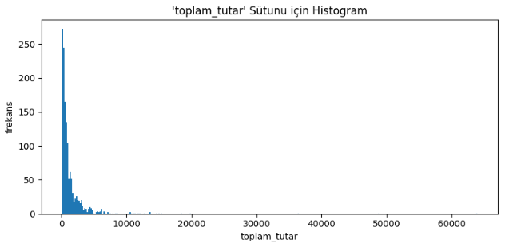
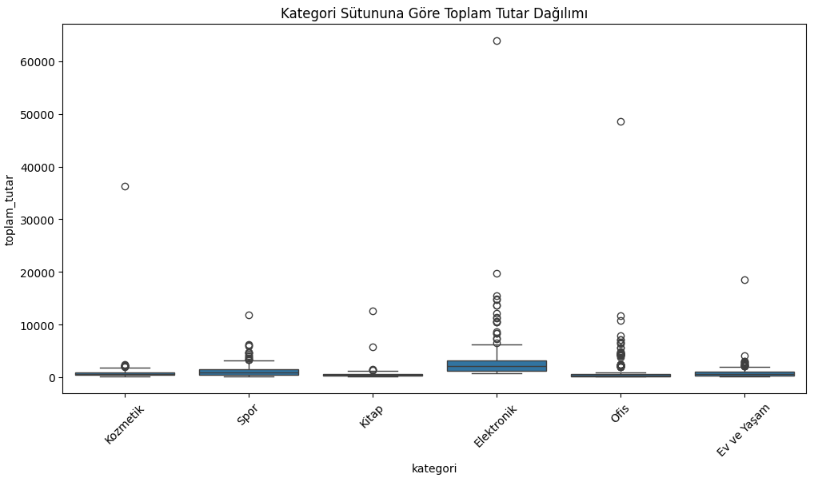
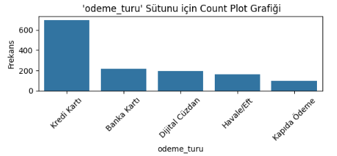

# E-Commerce Data Analysis & Business Insights

## 📌 Project Overview
This repository features a comprehensive Exploratory Data Analysis (EDA) and Data Cleaning pipeline for a Turkish e-commerce transactions dataset. The primary goal is to clean raw transactional data, perform statistical outlier detection, and derive actionable business intelligence regarding customer behavior and category performance.

## 🗂️ Project Structure
```
e-commerce-data-analysis/
├── data/
│   └── e_commerce_dataset.csv     # raw dataset (not tracked if large / confidential)
├── notebooks/
│   └── e_commerce_data_analysis.ipynb
├── images/                        # exported plots used below
├── requirements.txt
├── LICENSE
└── README.md
```

## 🛠️ Technologies Used
* **Language:** Python 3
* **Libraries:** Pandas, Matplotlib, Seaborn

## ⚙️ Setup & Usage
```bash
git clone https://github.com/<username>/e-commerce-data-analysis.git
cd e-commerce-data-analysis
pip install -r requirements.txt
jupyter notebook notebooks/e_commerce_data_analysis.ipynb
```

## 📖 Dataset
* **Source:** `data/e_commerce_dataset.csv` — _add the origin here (e.g. Kaggle link, or "synthetically generated for this project")_
* **Size:** 1,428 orders × 18 features (before cleaning), 1,370 × 22 after cleaning & feature engineering

| Column | Description |
|---|---|
| `siparis_id` | Unique order ID |
| `musteri_id` | Unique customer ID |
| `siparis_tarihi` | Order timestamp |
| `sehir` / `bolge` | Customer city / region |
| `kategori` / `urun_adi` | Product category / product name |
| `adet` | Quantity ordered |
| `birim_fiyat` | Unit price (TL) |
| `indirim_orani` | Discount rate |
| `kargo_ucreti` | Shipping fee |
| `odeme_turu` | Payment method |
| `musteri_tipi` | Customer segment (New / Existing / VIP) |
| `teslimat_gunu` | Delivery time (days) |
| `musteri_puani` | Customer rating (0–5) |
| `iade_durumu` | Return status |
| `kar_marji_orani` | Profit margin rate |
| `toplam_tutar` | Total order amount (TL) |

## ⚙️ Methodology & Workflow

**1. Data Cleaning & Preprocessing**
* The dataset initially contained 1,428 records and 18 features.
* Handled missing data via median imputation for continuous variables (`indirim_orani`, `musteri_puani`) and mode imputation for categorical variables (`odeme_turu`, `musteri_tipi`, `sehir`).
* Detected and removed 28 duplicate order records to maintain observational uniqueness.

**2. Feature Engineering & Text Normalization**
* Converted `siparis_tarihi` to datetime and engineered `siparis_yili`, `siparis_ayi`, `siparis_gunu`, and `haftanin_gunu`.
* Standardized categorical strings (lowercasing, stripping, Turkish-character replacement), reducing unique city count from 20 to 14 and consolidating product categories.

**3. Domain-Specific Validation & Outlier Detection**
* Removed records violating domain logic (zero/negative prices, negative delivery days, ratings above 5.0).
* Applied the IQR method on `birim_fiyat`, identifying 91 extreme outliers — kept in the dataset intentionally, as they largely represent legitimate high-ticket Electronics purchases rather than data errors.

**4. Exploratory Data Analysis (EDA)**
* Visualized `toplam_tutar` distribution via histogram and box plot, confirming a right-skewed distribution.
* Generated count plots showing *Kredi Kartı* (Credit Card) as the dominant payment method.

## 📊 Visualizations

**Distribution of `toplam_tutar` (right-skewed, driven by high-value Electronics orders)**


**Total amount by category (Electronics shows the widest spread and most outliers)**


**Payment method distribution (Kredi Kartı dominates)**


## 💡 Analytical Key Findings
* **Top Performing Category:** *Elektronik* yields the highest average transaction revenue at 3,178.4 TL, driving the majority of premium spending and extreme outliers.
* **Customer Demographics:** Existing customers (*Mevcut*) make up 51.02% of the user base, followed by New (*Yeni*) at 37.30%, and a niche VIP segment at 11.68%.
* **Satisfaction Metrics:** Overall mean customer rating is 3.99/5. Both Existing and New segments average 4.0.
* **Actionable Strategy:** Targeted marketing should capitalize on Electronics category momentum, while bespoke perks could help elevate the slightly trailing VIP segment.

## 📄 License
This project is licensed under the MIT License — see the [LICENSE](LICENSE) file for details.

## 👤 Author
_Add your name / GitHub / LinkedIn here._
